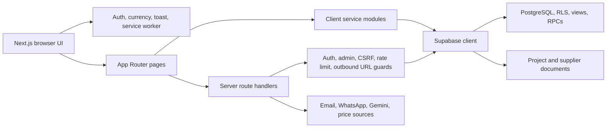
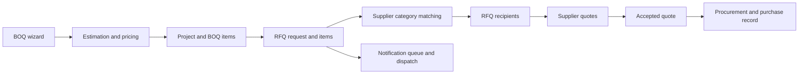
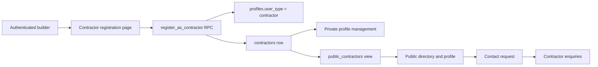

# ZimEstimate Architecture

Last verified: 2026-08-08  
Source commit: `16d6966c` on `unified`

This document describes the implemented system. Roadmaps and handover notes may
describe older states; use this file and the generated Graphify map as the
starting point for codebase questions.

## System at a Glance

ZimEstimate is a Next.js 16 application for construction estimation, project
tracking, procurement, supplier workflows, and contractor discovery in
Zimbabwe. Supabase provides authentication, PostgreSQL, row-level security,
RPCs, storage, and the persisted application model.



## Runtime Boundaries

| Layer | Primary locations | Responsibility |
| --- | --- | --- |
| Routes and pages | `src/app` | User workflows, server endpoints, layouts, metadata |
| Feature UI | `src/components` | Project, contractor, supplier, BOQ, utility, and shared UI |
| Client state | `src/store`, React providers | BOQ wizard state, auth state, currency, notifications |
| Domain services | `src/lib/services` | Supabase queries and workflow operations |
| Server controls | `src/lib/server` | Authentication, authorization, request security, dispatch, scraping |
| Domain engines | `src/lib`, `src/app/boq/new`, `src/lib/quick-projects` | Estimation, pricing, validation, exports, quick-project calculations |
| Database | `supabase/migrations` | Schema, RLS, views, triggers, RPCs, and seed changes |
| Verification | `src/**/*.test.*`, `tests` | Vitest unit tests and Playwright user-flow tests |

The root layout installs `AuthProvider`, `ServiceWorkerProvider`,
`CurrencyProvider`, and `ToastProvider` around every route. Graph analysis
identifies these providers, shared `Button` and `Card` components, `supabase`,
`MainLayout`, `Project`, and `BOQItem` as the most connected abstractions.

## Product Areas

| Area | Main routes | Main implementation |
| --- | --- | --- |
| BOQ estimation | `/boq/new`, `/quick-budget` | `src/app/boq/new`, `src/store/boqWizardStore.ts`, estimation and pricing modules |
| Projects | `/projects`, `/projects/[id]` | `src/lib/services/projects.ts`, project components, stages service |
| Procurement and RFQs | Project view, supplier leads/dashboard | `rfq.ts`, `UnifiedProcurementView.tsx`, `RfqPanel.tsx` |
| Contractors | `/contractor/register`, `/contractor/profile`, `/contractors`, `/contractors/[id]` | `contractors.ts`, contractor components, migrations 037, 046, 047 |
| Suppliers | `/supplier/*`, `/marketplace/suppliers/*` | `suppliers.ts`, subscriptions, supplier portal and marketplace pages |
| Pricing | `/marketplace`, `/market-insights`, scraper routes | `prices.ts`, scraper runner, pricing scripts, price tables |
| Administration | `/admin/*` | Admin pages, `admin-analytics.ts`, guarded API routes |
| AI tools | `/ai/*`, vision API routes | Gemini integration and vision-takeoff components |
| Notifications | `/notifications`, dispatch routes | `notifications.ts`, server dispatch, push service worker |

## Identity and Access

The account role is `profiles.user_type` with these valid values:

- `builder`: default authenticated customer role.
- `contractor`: self-service registration through the guarded
  `register_as_contractor` RPC.
- `supplier`: assigned through the supplier approval workflow.
- `admin`: privileged application administration.

Subscription access is separate from role and uses `profiles.tier` plus supplier
subscription tables. Route handlers use `requireAuth` and `requireAdmin`.
Database authorization is primarily enforced through RLS and security-definer
functions. Migration 047 prevents clients from changing account roles directly,
exposes only the safe `public_contractors` projection, and adds database-backed
API rate limiting.

## Core User Flows

### BOQ to Procurement



Important boundaries:

- Wizard state lives in `boqWizardStore.ts`; calculation code is separate from
  persistence.
- `projects.ts` owns project, BOQ item, purchase, sharing, document, reminder,
  usage, and utility persistence.
- `rfq.ts` owns supplier matching, RFQ creation, quote submission, and quote
  acceptance.
- Database RPCs make multi-table RFQ creation atomic.
- Supplier requests receive quantities and specifications, not the estimator's
  internal target prices.

### Contractor Lifecycle



`src/lib/services/contractors.ts` separates private contractor records from the
public directory projection. `src/lib/services/leads.ts` owns creation and
management of supplier and contractor enquiries.

## Data Domains

The database is migration-owned. Major domains include:

- Identity: `profiles`.
- Estimation: `projects`, `boq_items`, `quick_boqs`, `project_stages`,
  `stage_tasks`.
- Project execution: `purchase_records`, `material_usage`, reminders,
  notifications, documents, shares, and utility configuration.
- Marketplace: `suppliers`, `supplier_applications`, `supplier_products`,
  supplier documents, API keys, subscriptions, and payments.
- RFQ: `rfq_requests`, `rfq_items`, `rfq_recipients`, `rfq_quotes`,
  `rfq_quote_items`, and the notification queue.
- Contractors: private `contractors` records and the `public_contractors` view.
- Pricing: materials, sources, observations, weekly aggregates, aliases,
  scraper configuration, review, and logs.
- Operations: contact requests, support tickets, replies, and audit logs.

Do not infer deployed schema solely from migration history. Verify important
tables, views, functions, and RLS policies against the linked Supabase project.

## External Integrations

- Supabase authentication, PostgreSQL, RPC, RLS, and storage.
- Vercel hosting and analytics.
- Google Gemini for vision-assisted workflows.
- Email, WhatsApp, and web-push notification channels.
- Configured public pricing sources through the scraper subsystem.
- Browser service worker for PWA and push behavior.

External requests must pass the outbound URL validation in
`src/lib/server/outboundUrl.ts`. Server routes should use the shared request
security and authorization helpers rather than reimplementing them.

## Verification and Delivery

Local quality gate:

```bash
npm run lint
npm run typecheck
npm run test:unit
npm run build
npm run test:e2e:smoke
```

The production branch is `unified`. At the time of this map, GitHub Actions CI
runs on pull requests and pushes to `main` or `release/**`, but not pushes to
`unified`. That mismatch is an operational gap and should be corrected before
relying on CI as the production release gate.

## Graphify Map

Generated local artifacts are intentionally ignored by Git:

- `graphify-out/graph.html`: interactive relationship graph.
- `graphify-out/GRAPH_TREE.html`: file hierarchy with symbol relationships.
- `graphify-out/graph.json`: queryable graph data.
- `graphify-out/GRAPH_REPORT.md`: generated graph summary.

The initial local-only extraction includes TypeScript, JavaScript, configuration,
and all 47 SQL migrations. It contains 2,412 nodes, 5,826 edges, and 150
communities. No external LLM tokens were used.

Refresh after code changes:

```bash
graphify update .
graphify cluster-only . --no-label
graphify tree --graph graphify-out/graph.json \
  --output graphify-out/GRAPH_TREE.html --root . --label ZimEstimate
graphify export obsidian \
  --dir "$HOME/Documents/Obsidian Vault/ZimEstimate Codebase"
```

Ask relationship questions:

```bash
graphify query "How does contractor registration reach the public directory?"
graphify path "useAuth()" "contractor/register/page.tsx" --undirected
graphify affected "requireAdmin()" --depth 2
graphify explain "createRfqRequest()"
```

The local-only graph proves structural relationships. Cross-layer behavior that
depends on dynamic Supabase calls may require reading the cited service and SQL
sources together; do not treat a missing graph path as proof that no runtime
relationship exists.

## Current Structural Risks

1. Documentation drift has already caused implemented contractor functionality
   to be described as missing.
2. End-to-end coverage is small relative to the route and workflow surface.
3. The production branch is absent from the push-triggered CI branch list.
4. `projects.ts` has accumulated several data domains and is a high-change,
   high-impact service boundary.
5. Authentication and shared UI providers are high fan-out modules; changes to
   them require broad regression testing.
